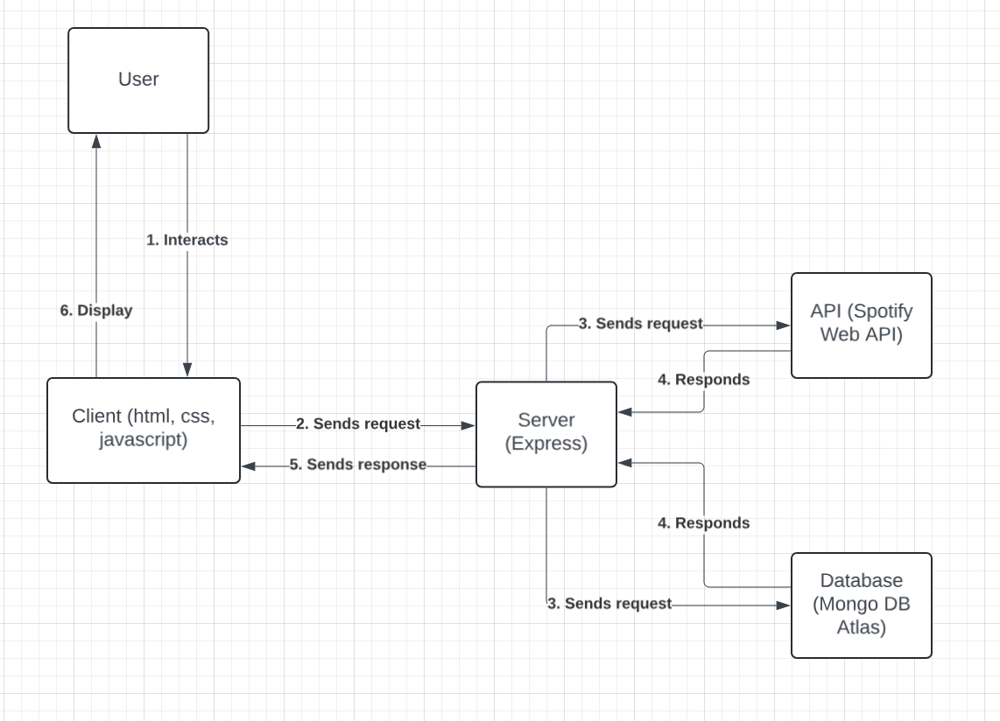
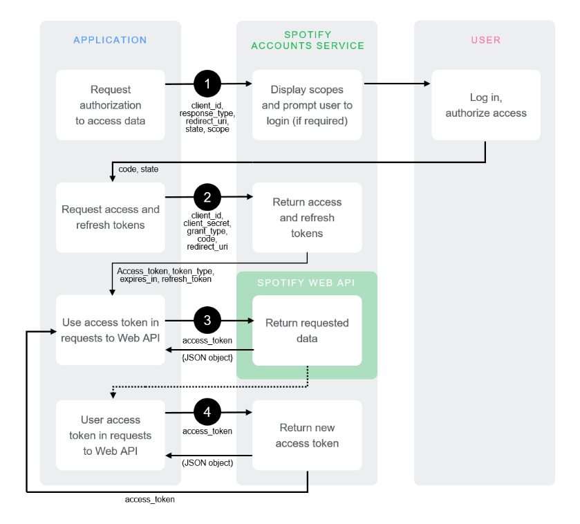

The planned application for this project is a web application that will feature different type of games. The general plan for the architecture is to use a stack featuring both front and back end components. For the client side, **ejs** will be used to generate **HTML** pages, **CSS** will be used for styling, **Javascript** will be used for scripting and **Node.js** as the runtime environment. The client will then interact with an **Express** server that will handle http requests to different routes that will prompt different actions depending on request. The requests can be authentication, which will be handled by using **Oauth2**, to request authentication through Spotify. It can also be fetching artists/songs for each game using the **Spotify Web API**. A database will be used for storing high scores for each game mode, **Mongo DB Atlas** will be used in production and **MongoDB Compass** will be used during development, **mongoose** will be used to design each database schema. The deployment of the application will be on a school **cscloud** machine using **Nginx** and **pm2.** For testing and confirming that each component runs properly manual user tests will be performed along with automated tests using **Jest**.

General architecture for each game mode:

Planned architecture for authentication using Ouath2 with Spotify as the provider. (Image taken from https://developer.spotify.com/documentation/web-api/tutorials/code-flow)

