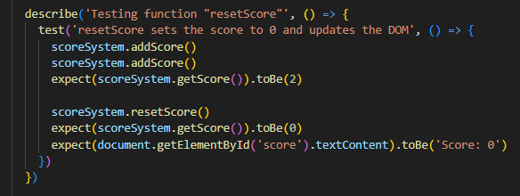

Date for report: 2024-05-11

Tested system version/branch: feature/higherorlower

Tests has been performed using automated testing with Jest.

Automated tests for issue: [#4](https://gitlab.lnu.se/1dv613/student/dp222ky/projects/spotify-arcade/-/issues/4)

Tests performed on higherOrLowerMechanics.js:

Function checkGuess()

function fetchNewArtist()

function endGame()

Results:

Tests performed on HigherOrLowerUI.js

Function updateUIAfterGuess():

Function hideButtonShowSecondValue():

Results:

Tests performed on scoreSystem.js:

function addScore()

function resetScore():

function getScore():

results:

# Comments

Overall the game mode system is working properly and bugs that occured has been handled. All tests passed. A good thing is that the logic is seperated in classes/modules which makes it easier to test. A thing that could be improved though is to seperate functions to handle less functionallity to better adhere to single responsibility principle.