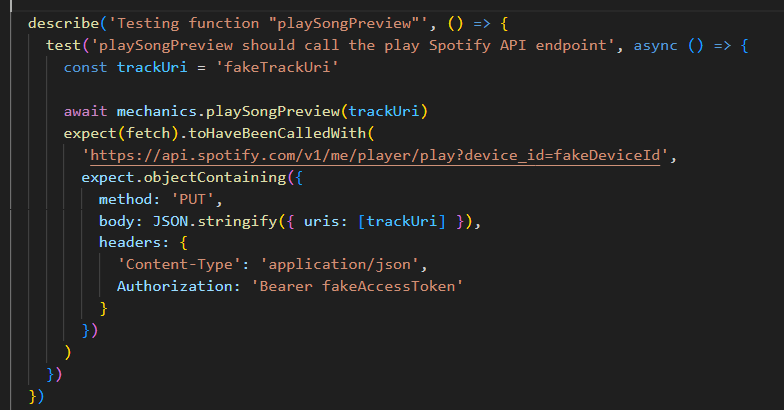
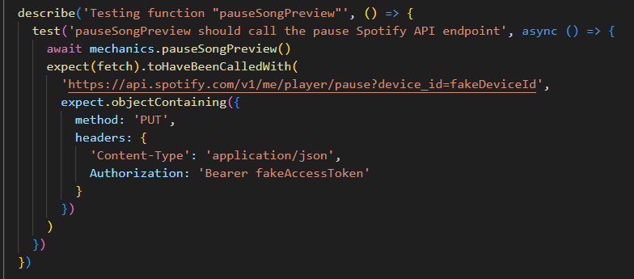
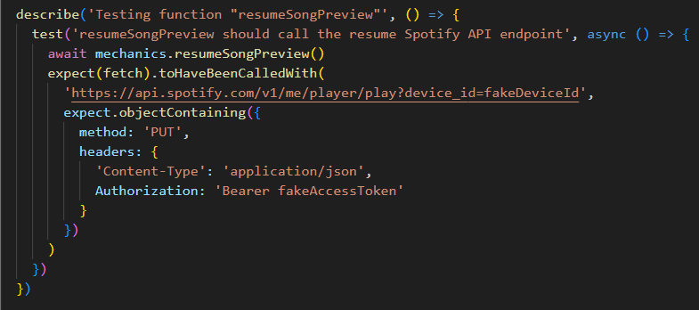
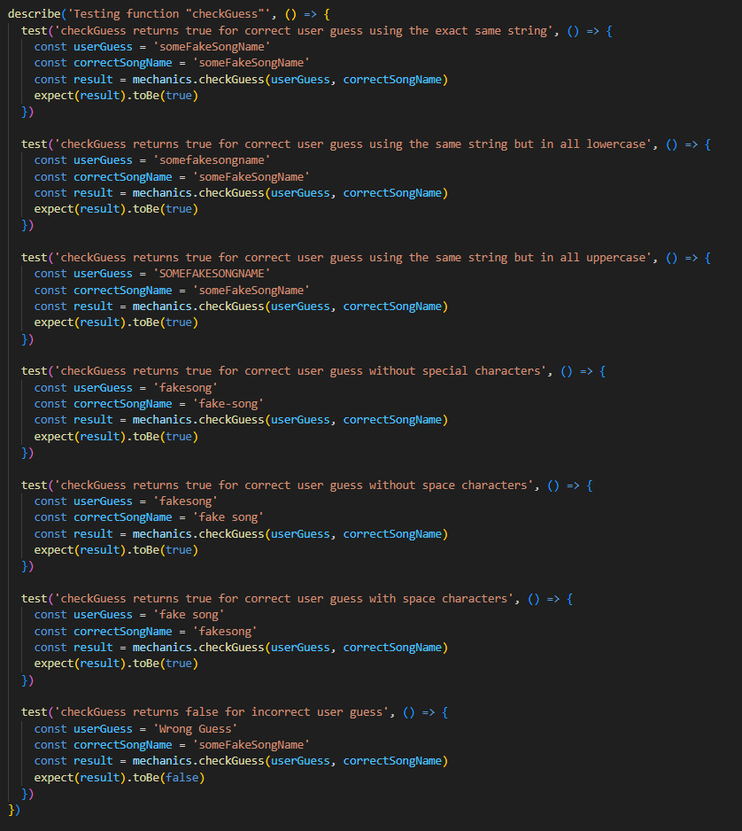
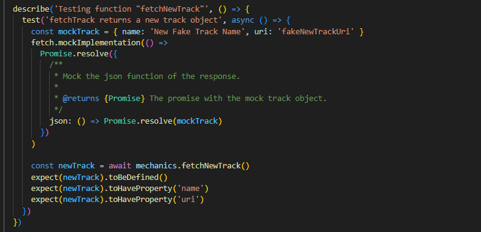
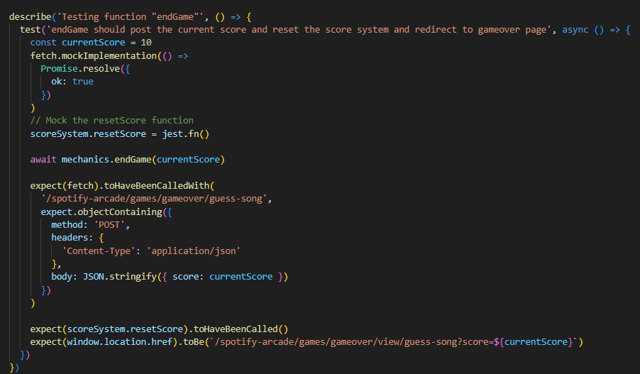
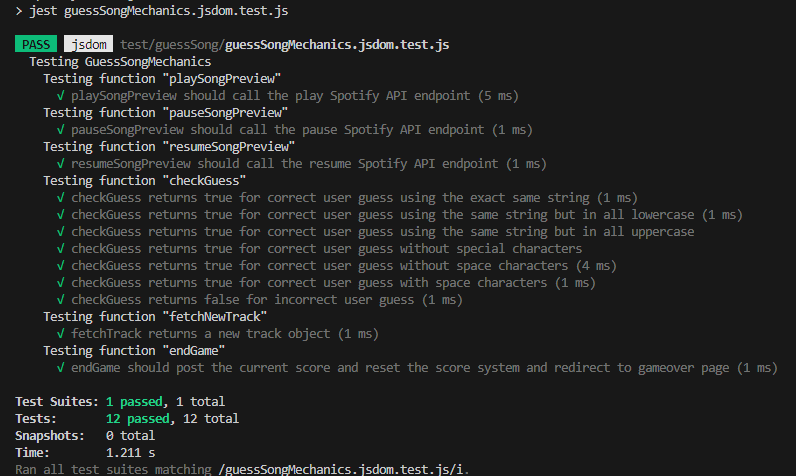
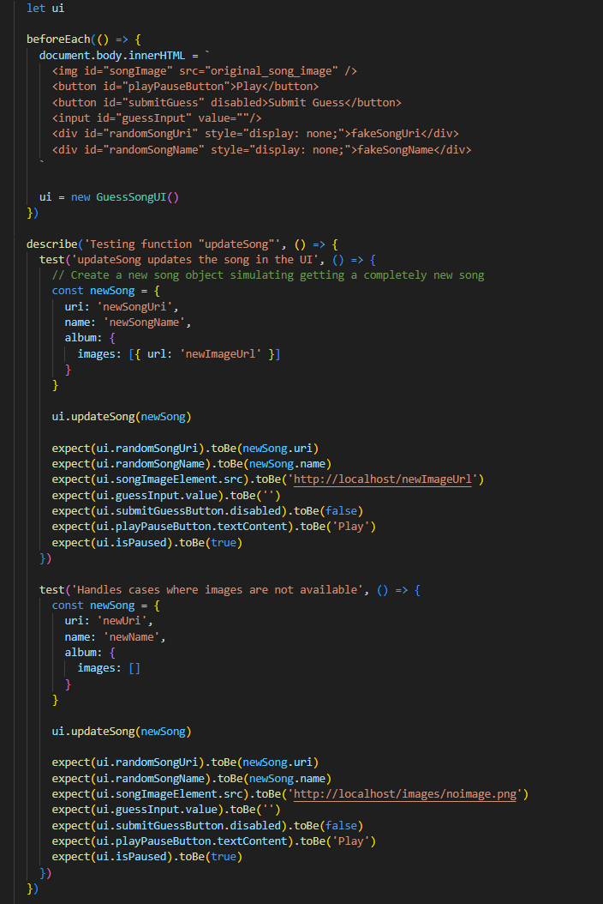
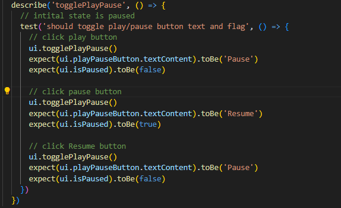
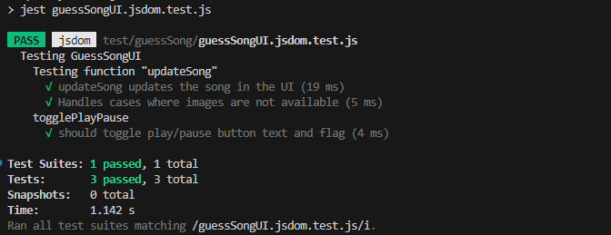

Date for report: 2024-05-18

Tested system version/branch: test/guessSong

Tests has been performed using automated testing with Jest.

Automated tests for issue: [#5](https://gitlab.lnu.se/1dv613/student/dp222ky/projects/spotify-arcade/-/issues/5)

Tests performed on guessSongMechanics.js:

function playSongPreview():

function pauseSongPreview():

function resumeSongPreview():

function checkGuess():

function fetchNewTrack():

Function endGame()

Results:

Tests performed on guessSongUI.js:

function updateSong():

function togglePlayPause():

Results:

# Comments

All tests are passing, bugs that occured has been handled. Improvements: The game mode is currently ending the game after user is guessing wrong without showing which song was the correct answer.