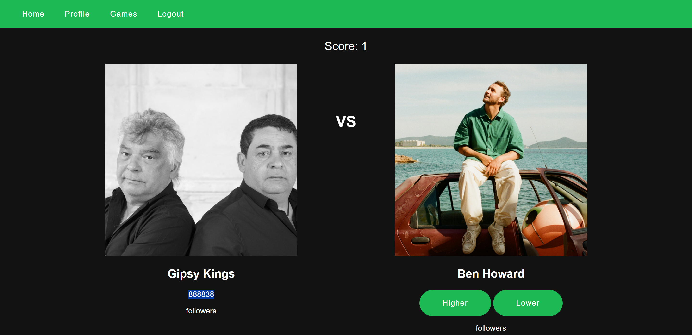
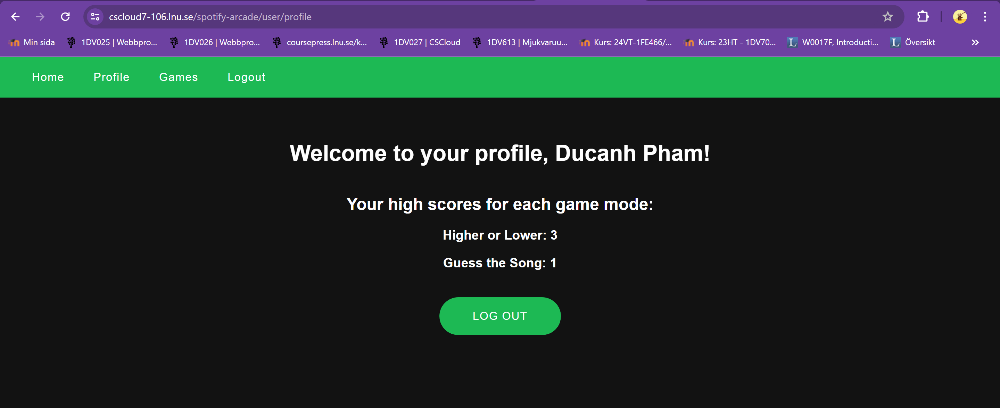
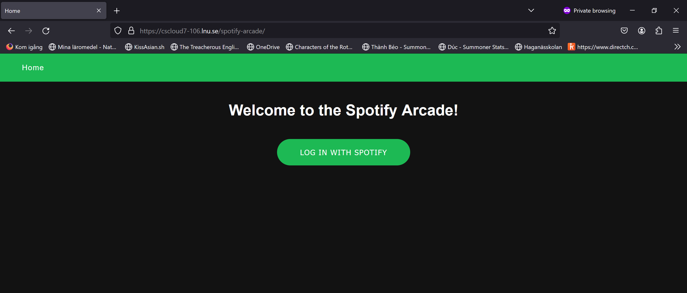
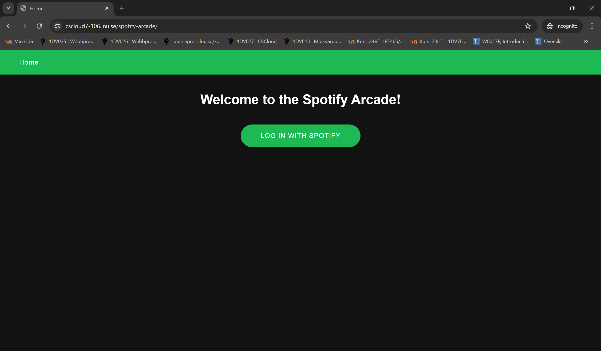

## **Testrapport 4**

Date for report: 2024-05-22

Tested system version/branch: Production mode at: https://cscloud7-106.lnu.se/spotify-arcade/

Tests has been performed by the user/developer manually.

# Test Cases

## Test case 3: The system should have atleast one playable gamemode. Based off of issue: [#2](https://gitlab.lnu.se/1dv613/student/dp222ky/projects/spotify-arcade/-/issues/2 "There should be atleast one playable game mode.")

### Test case 3.1: The game mode higher or lower is presenting next options on correct guess.

Verify that the game mode higher or lower is working properly by testing that the user is presented new option and given a point on each correct guess.

### Input

1. Navigate to the home page for the application. https://cscloud7-106.lnu.se/spotify-arcade/
2. Click on button "Log in with Spotify".
3. Navigate to the "Games" menu.
4. Select the game mode "Higher Or Lower"
5. Click the button "Lower" at the second option "Gipsy Kings", first option is "Charlie Puth" with "22636877" followers

### Output

The first option is updated to "Gipsy Kings", with "888838" followers. Score is updated to 1. The second option is updated to "Ben Howard".

### Test case 3.2: The game mode higher or lower is ending the game on a wrong guess.

Verify that the game mode higher or lower is ending the game and presenting a game over page with the current score and highscore.

### Input

1. Navigate to the home page for the application. https://cscloud7-106.lnu.se/spotify-arcade/
2. Click on button "Log in with Spotify".
3. Navigate to the "Games" menu.
4. Select the game mode "Higher Or Lower"
5. Click the button "Higher" at the second option "Tycho", first option is "Gustavo Lima" with "20813340" followers

### Output

The system navigated to a page that presents "Game Over". "Your Score: 0". "High score for higherorlower: 3". And two buttons "Play Again" and "Play Another Game"

## Test case 4: **The user should be able to easily access all their highscores.** Based off of issue: [#11](https://gitlab.lnu.se/1dv613/student/dp222ky/projects/spotify-arcade/-/issues/11 "The user should be able to easily access all their highscores.")

### Test case 4.1: The application is presenting the available highscores at the "profile" page.

Verify that the available highscores should be accessible in one place.

### Input

1. Navigate to the home page for the application. https://cscloud7-106.lnu.se/spotify-arcade/
2. Click on button "Log in with Spotify".

### Output

The user is navigated to their profile page. "Welcome to your profile, Duc Anh Pham" is presented. "Your high scores for each game mode: Higher or Lower: 3, Guess the song: 1" is presented. A log out button is presented.

## Test case 5: **The application should be accessible over the internet.** Based off of issue: [#12](https://gitlab.lnu.se/1dv613/student/dp222ky/projects/spotify-arcade/-/issues/12 "The application should be accessible over the internet.")

### Test case 5.1: The application is accessible on Mozilla Firefox.

Verify that the application is available on Mozilla Firefox and presenting the page properly.

### Input

1. Open web browser "Mozilla Firefox" in private mode.
2. Enter the apps URL into the web browsers adress bar. (https://cscloud7-106.lnu.se/spotify-arcade/)

### Output

The user is navigated to the home page application. With an option to log in.

### Test case 5.2: The application is accessible on Google chrome.

Verify that the application is available on Google Chrome and presenting the page properly.

### Input

1. Open web browser "Google chrome" in incognito mode.
2. Enter the apps URL into the web browsers adress bar. (https://cscloud7-106.lnu.se/spotify-arcade/)

### Output

The user is navigated to the home page application. With an option to log in.

# Comments

Tested the application in production mode, overall system feels good, functionallity is working as intended, no bugs is occuring so far. Probally ready for finalizing. Final quality assurance next.