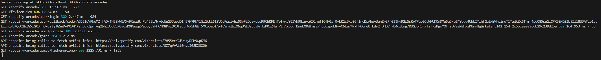
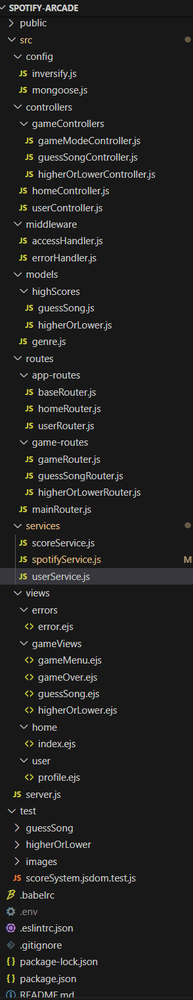
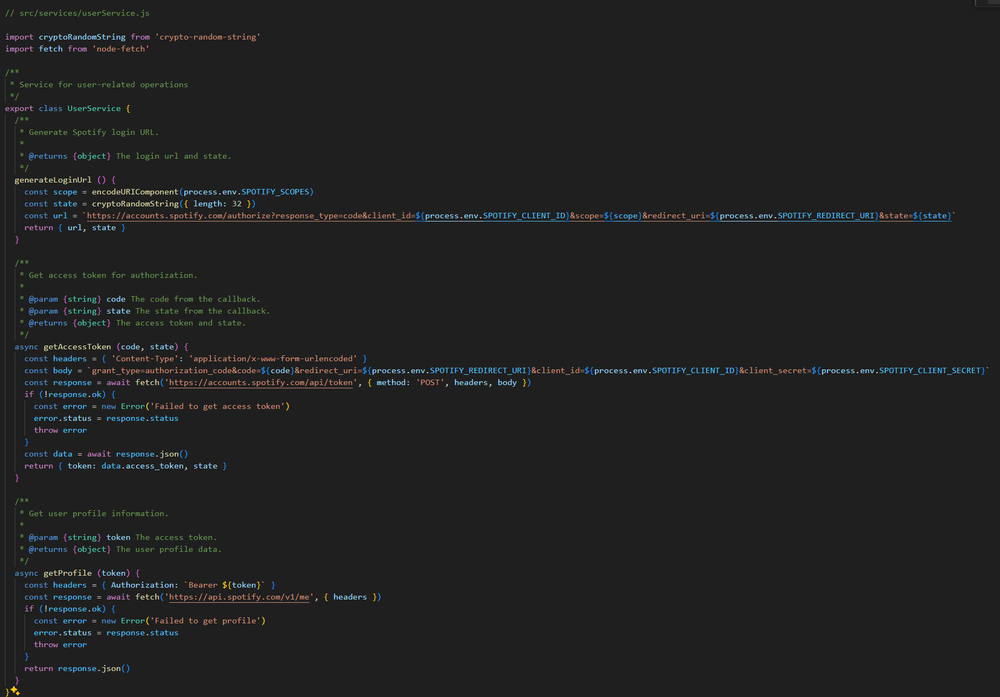
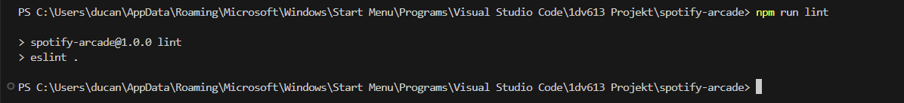

## **Testrapport 5**

Date for report: 2024-05-27

Tested system version/branch: Development mode/main

Tests has been performed by the user/developer manually.

# Test Cases

## Test case 6: The application should use a credible source for game data. Based off of issue [**#7**](https://gitlab.lnu.se/1dv613/student/dp222ky/projects/spotify-arcade/-/issues/7 "The application should use a credible source for game data.")

### Test case 6.1: **The system fetches game data from Spotifys web API.**

Verify that the application successfully retrieves and uses game data from Spotifys web APIs endpoints.

### Input

1. Navigate to the home page for the application.
2. Click on button "Log in with Spotify".
3. Navigate to the "Games" menu.
4. Select the game mode "Higher Or Lower"
5. Inspect the application code, along with its logs to confirm that the Spotify web API is being used for fetching artists.

### Output

The console is logging each endpoint being used to fetch each subsequent artist.

## Test case 7: **The application code should be well structured. Based off of issue** [#9](https://gitlab.lnu.se/1dv613/student/dp222ky/projects/spotify-arcade/-/issues/9 "The application code should be well structured")

### Test case 7.1: **Code structure review**.

Verify that the code is well structured and separated into fitting parts.

### Input

1. Open the code repository.
2. Review the code files and directory strucutre.

### Output

The code is divided into modules. Directory files names are descriptive and reflects their contents. The files/folders are seperated into fitting catalogs. The code follows a consistent naming convention.

## Test case 8: **The source code is following a coding standard. Based off of issue** [#10](https://gitlab.lnu.se/1dv613/student/dp222ky/projects/spotify-arcade/-/issues/10 "The source code is following a coding standard.")

### Test case 8.1: **Running ESLint checks.**

Verify that the source code follows the coding standard defined by the @lnu/eslint-config package and passes all ESLint checks without errors or warnings.

### Input

1. Open the project in visual studio code.
2. Open the terminal in the root directory of the project.
3. Run the command "npm run lint"

### Output

The ESLint process completes without any errors or warnings.

# Comments

Tested the applications non functional requirements and that the application is using Spotifys Web API for fetching information. Works as intended. ESlint is passing. Code looks ok, functions could be more single responsible, but overall still an acceptable size.